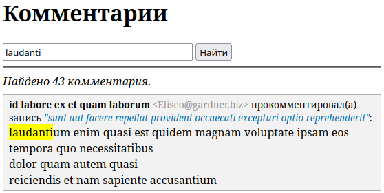

# inline-test-task

## Инструкция
1. Настроить сервер (пример конфига для Apache2 есть в файле `misc/apache2.conf`). Web-корень должен указывать на папку `public_html`. Все запросы на несуществующие файлы должны перенаправляться на `public_html/index.php` (см. `public_html/.htaccess`). (Проект будет работать и под nginx, если настроить его соответствующим образом.)
2. Скопировать/переименовать файл `config/config.php.dist` в `config/config.php`, указать данные для доступа к БД (MySQL).
3. Импортировать дамп БД (файл `misc/db_dump.sql`), используя phpmyadmin или другие способы.
4. Запустить скрипт загрузки и импорта данных в БД с помощью консольной команды `tools/import_db` (или `php tools/import_db`). Согласно заданию, в дамп БД включена только структура таблиц, без самих данных.
5. Открыть сайт в браузере. Ссылка "Поиск комментариев" на Главной странице ведёт на страницу "Комментарии" с формой поиска комментариев.

